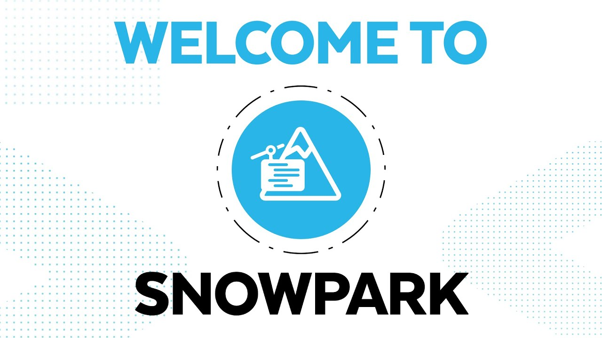

## Introduction

This repository is the source of my presentation in the **Big Data London 2022** where I talked about **Accelerating Machine Learning Adoption with Snowpark** 

In this code I quick demonstrate the steps to run a model training including the **store procedure** for the model trainig as per the Snowflake recommendation.

You can also see how to make a ML model available and make it available to business users to consume it within their own Snowflake queries, for example.

Please note that, I have prepared an introduction demo about Snowpark that is available **[here](https://github.com/MauricioLins/snowpark-quickdemo)**

For this Machine Learning model I am using the same dataset, but in the repository above I will walk you through the steps to create stages to make your data available.

## How to

1. Before you start you will need to install the Snowpark Python library that is available **[here](https://pypi.org/project/snowflake-snowpark-python/)**

2. Once you have make the data available in Snowflake you can run the notebook **snowpark-ml** available here to start runing the model training and the model consumption.